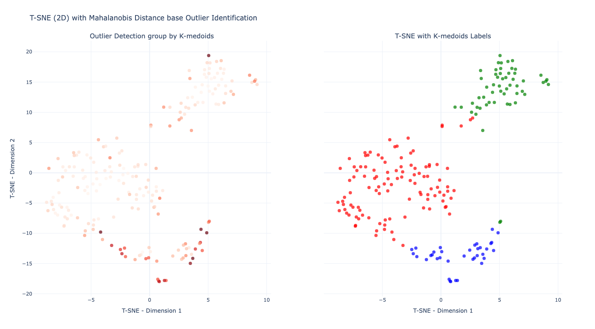
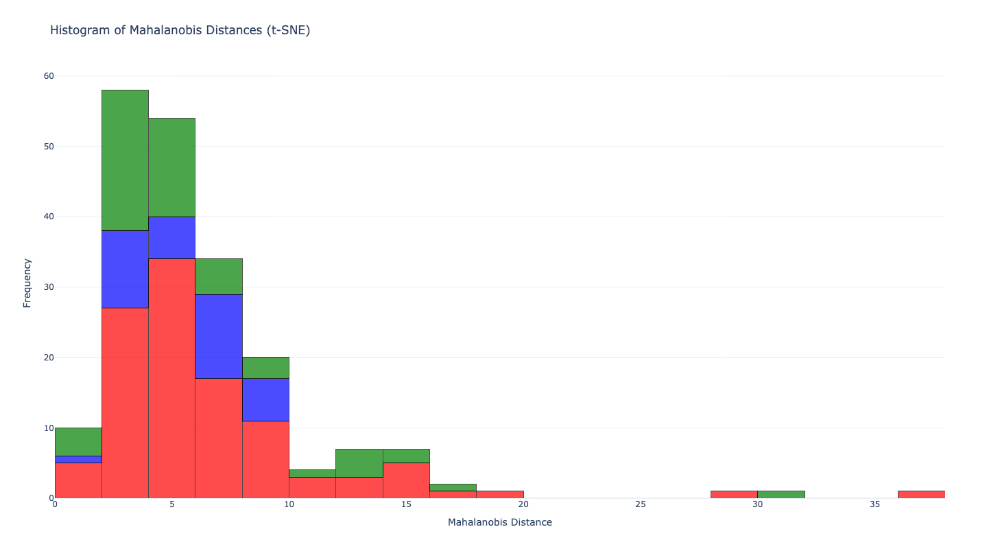
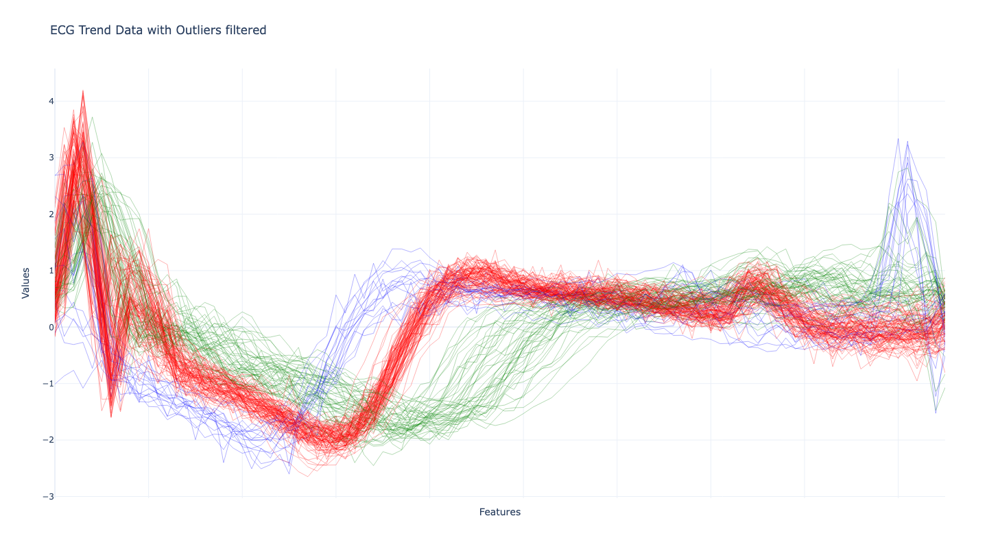

# ECG時間序列分群與異常點檢測
## 專案簡介

此專案展示了一個基於時間序列資料的離群值檢測流程。首先使用**K-medoids**對資料進行分群，然後基於不同的群計算逐點的馬氏距離(**Point-Wise Mahalanobis Distance**)，以此識別群體中的離群值。

## 專案動機
實務上，設備參數通常會隨時間產生趨勢，可視為時間序列資料。此外，同一設備可能被用於生產多種產品，因此需要一個能在不同群體間辨別離群樣本或偏移趨勢的算法。若能提前識別這些異常，便能在品質問題發生之前採取應對措施，也能讓一些統計估計值較為穩定。為了解決這一問題，我們引入**K-medoids**分群方法與逐點馬氏距離的計算。**K-medoids**分群能有效降低離群值對群心估計結果的影響，而逐點馬氏距離的計算則可偵測距離群心較遠的樣本，藉此解決現有的痛點，實現更高效的異常檢測，並讓估計更加準確。

## 實際資料應用：

使用公開數據集[ECG(心電圖)](https://www.timeseriesclassification.com/description.php?Dataset=ECG200)進行實作展示。首先觀察到數據有明顯分群跡象後，透過**K-medoids**將數據分群，並針對各個群體計算，接著根據所計算出來的距離進行異常點的判定，以下展示詳細流程。

### 資料探索：
首先觀察數據分布，數據大致上分布如下：

數據大致可分為三組。

備註：若這三個群體各自具有背後代表的特定意義，例如這三個群體分別代表健康的人，患有Ａ病徵的人，患有Ｂ病徵的人。那麼進行分群是必要的。如果不分群，而將各群體的標準差一同估計，可能會導致估計的標準差過大。在實務應用中，應與具備專業知識的人員探討此現象並進行確認。基於假設這三個群體各有其背後代表的意義，我們進一步對數據進行分群分析。

### 資料分群與距離計算：

透過**K-medoids分群**，將數據分為三群，結果如下圖所示：

為了更直觀地觀察分群結果，使用**t-SNE**將數據投影至二維空間，投影結果如下方右圖所示：

上圖顯示分群方法成功地將數據合理分為三組，同時可以觀察到一些零星的離群值，例如分布於藍色聚類附近的綠色樣本。

接下來，以分群估計出的群心為中心，計算各點相對於群心的馬氏距離(Mahalanobis Distance)，其計算結果如上左圖所示。進一步將各樣本的馬氏距離繪製為直方圖，結果如下：

從直方圖中可以發現，馬氏距離落在0至10區間較多，大於10的樣本比較少。此處將距離大於10的樣本踢除，並檢視結果。

備註：我們選擇**K-medoids**分群而非**K-means**分群的原因在於，統計上中位數在存在離群值的情況下相較於平均值更為穩定。而**K-medoids**分群的特點是使用實際數據點作為群心，這使其相較於以群平均作為群心的**K-means**分群更加穩健，能有效降低離群值對分群結果的影響。

### 踢除離群值
踢除離群值後，結果如下圖所示：

一些明顯的離群值被踢除，如此一來在估計各個群體平均值以及標準差變得更準確。

關於被踢除的離群值，應採取以下步驟：
1. 逐樣本確認：提供初步判定的離群樣本，協同專業人士逐一確認是否真實為離群，並排查其背後原因。
2. 誤判樣本處理：將誤判為離群的樣本重新納入數據集，並更新統計估計值。

對於踢除離群值後估計的平均數與標準差，可進行以下應用：
1. 結果驗證：與專業人士確認估計結果是否符合經驗，保證統計值的合理性。
2. 新樣本分類：利用估計的平均數與標準差，對新樣本計算其馬氏距離是否小於邊界值，判定其是否屬於現有群體；若不符合，則該新樣本可能為離群樣本。
3. 離群樣本觀測：對不屬於現有群體的新樣本，暫時視為離群樣本，並持續觀測後續數據中是否出現與其分布相似的樣本。同時，與專業人士協同分析，以確保判斷的準確性。 

## 衍生應用
設備的量測參數（如電壓、電流、溫度、氣壓等時間序列資料）在生產不同機種時會因配方不同而呈現差異。針對此情況，可先將不相似的配方進行分群，再進一步進行離群值檢測，以有效識別各群體中的異常樣本。

