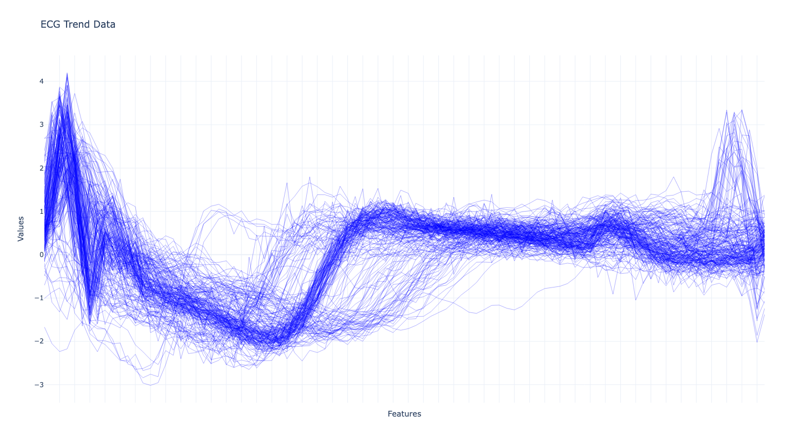
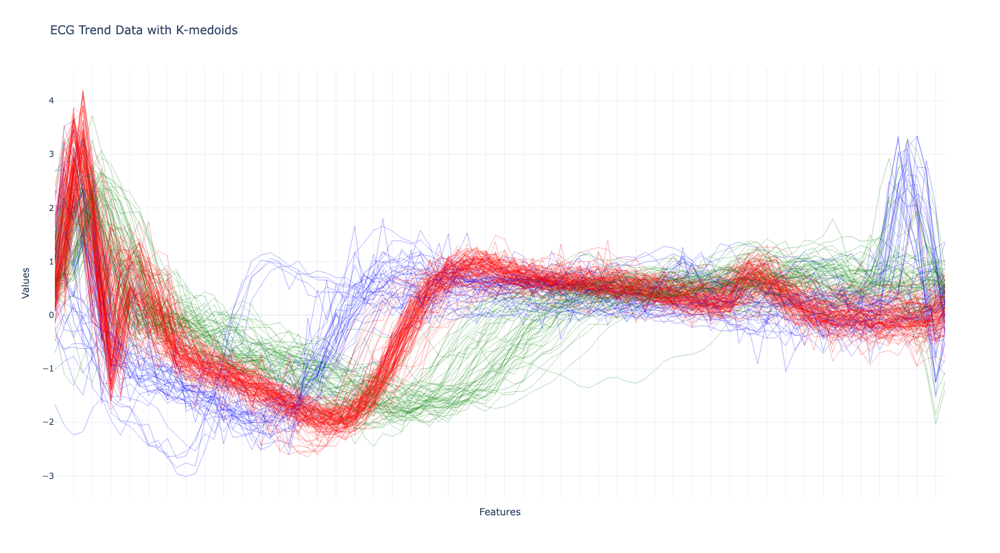

# ECG時間序列分群與異常點檢測
## 專案簡介

此專案展示了一個基於時間序列資料的離群值檢測流程。首先使用**K-medoids**對資料進行分群，然後基於不同的群計算逐點的馬氏距離(**Point-Wise Mahalanobis Distance**)，以此識別群體中的離群值。

## 專案動機
實務上，設備參數通常會隨時間產生趨勢，可視為時間序列資料。此外，同一設備可能被用於生產多種產品，因此需要一個能在不同群體間辨別離群樣本或偏移趨勢的算法。若能提前識別這些異常，便能在品質問題發生之前採取應對措施。為了解決這一問題，我們引入**K-medoids**分群方法與逐點馬氏距離的計算。**K-medoids**分群能有效降低離群值對群心估計結果的影響，而逐點馬氏距離的計算則可偵測距離群心較遠的樣本，藉此解決現有的痛點，實現更高效的異常檢測。

## 專案內容

### 實際資料應用：

使用公開數據集[ECG(心電圖)](https://www.timeseriesclassification.com/description.php?Dataset=ECG200)進行實作展示。首先觀察到數據有明顯分群跡象後，透過**K-medoids**將數據分群，並針對各個群體計算，接著根據所計算出來的距離進行異常點的判定，以下展示詳細流程。

#### 資料探索：
首先觀察數據分布，數據大致上分布如下：

數據大致可分為三組。若這三個群體各自具有背後代表的特定意義，那麼進行分群是必要的。如果不分群，而將各群體的標準差一同估計，可能會導致估計的標準差過大。在實務應用中，應與具備專業知識的人員探討此現象並進行確認。基於假設這三個群體各有其背後代表的意義，我們進一步對數據進行分群分析。

#### 資料分群：

透過**K-medoids分群**，將數據分為三群，結果如下圖所示：

該方法成功地將數據合理分為三組。我們選擇**K-medoids**分群而非**K-means**分群的理由在於，統計上在存在離群值的情況下，中位數相較於平均值更為穩定。而**K-medoids**分群的特點正是使用實際數據點作為群心，這使得其相較於以群平均作為群心的**K-means**分群更為穩健，能有效減少離群值對分群結果的影響。

#### 資料距離計算：

可以看到分群後，各個群體內部存在些許離群值，以分群所估計出的群心為中心，計算各點之餘中心的點的馬氏距離

### 衍生應用
設備的量測參數（如電壓、電流、溫度、氣壓等時間序列資料）在生產不同機種時會因配方不同而呈現差異。針對此情況，可先將不相似的配方進行分群，再進一步進行離群值檢測，以有效識別各群體中的異常樣本。