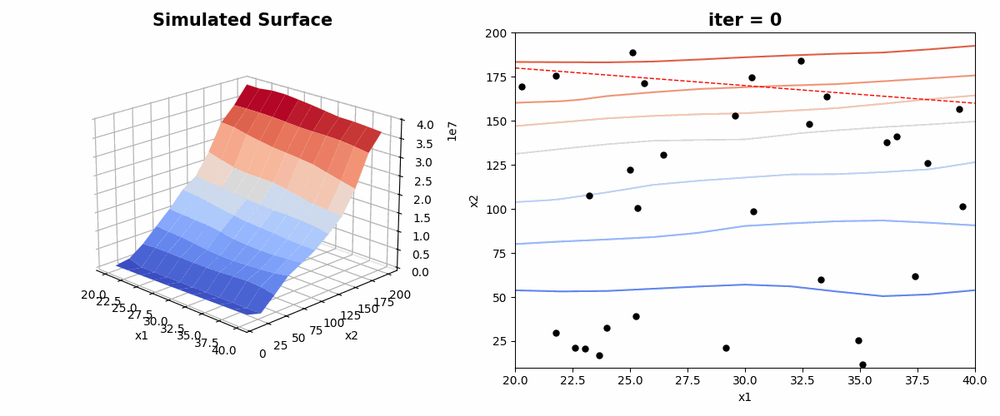

# 數據驅動的目標函數估計與最佳化
## 專案簡介

此專案展示了一個數據驅動的目標函數估計與最佳化流程。結合數據模擬、表面估計及優化技術，針對複雜或無法明確表達的目標函數進行反應曲面的建模與估計，進一步實現基於該反應曲面的最佳化，求得使目標函數 $\hat{f}(x)$ 最小化或最大化的最佳解 $x$。

## 專案動機

實務上，設備量測變數( $y$ )與設定參數( $x$ )之間的關係往往難以用單一函數形式 $y = f(x)$ 精確描述，或者該函數可能會隨時間動態變化為 $y = f(x, t)$。這種情況下，目標函數的不可明確性為最佳化過程帶來挑戰。為了解決此問題，我們引入機器學習技術，以近似方式估計函數 $f(x)$，並建立一個學習到的函數 $\hat{f}(x)$。基於此估計函數 $\hat{f}(x)$，我們可以進一步進行目標函數的最佳化，從而找到使目標值最小化或最大化的最佳解 $x$，並隨時檢視模型成效，適時重新訓練以確保函數近似得宜。這一方法有效地應對了目標函數不明確或動態變化所帶來的挑戰。

## 專案內容

### 方法模擬：

將我們的方法應用於模擬生成的數據上，假設數據來自以下目標函數分佈：

``` python
def f1(x1, x2):
   return (-np.cos(np.pi * (x1)) * np.cos(2 * np.pi * (x2))) / (
      1 + np.power(x1, 2) + np.power(x2, 2)
   )
```
隨機生成 3000 筆帶有隨機誤差的資料 $(x_1, x_2)$，並假設隨機誤差分布符合常態分布，標準差為 0.1。

將生成的資料 $(x_1, x_2)$ 輸入深度學習模型 $\hat{f}$，輸出估計值 $\hat{y}$，並使用均方根誤差損失（RMSE Loss）計算 $\hat{y}$ 與真實值 $y$ 的誤差直到收斂。模型訓練持續 $100$ 個梯次後收斂，其配適結果如 **下圖左** 所示，$R^2 = 0.98$。對已收斂的估計反應曲面 $\hat{f}$ 使用粒子群最佳化（PSO），最終收斂至全域最小值。結果展示於 **下圖右**，可以看到粒子群完美地找到目標函數的最小值。


在一樣的條件下，加劇目標函數的複雜程度，變更目標函數分佈為：
``` python
def f2(self, x1, x2):
   return -1 * np.power(np.cos((x1 - 0.2) * x2), 2) + x1 * np.sin(2 * x1 + x2)
```
可以發現在該模型能夠很好的描繪反應曲面變動，而粒子群也能找到最小值。


### 實際資料應用：


為了讓功能更加明確，將我們的方法應用於實際資料，取用[內政部不動產交易實價查詢服務網](https://plvr.land.moi.gov.tw/DownloadOpenData)所提供之不動產成交資料。倘若我們有購屋需求，想知道地點在臺中市西區，建物與車位總面積超過200平方公尺空間的條件限制下，如何購買到最低價格的物件。
為此，我們取用2024年第二季與第三季的預售屋成交資料，並建立一個深度學習模型，構建車位總面積，物件總面積與物件價格之間的關係模型 $\hat{f}(x)$。接著，透過粒子群最佳化（PSO），在設定的條件空間中（即地點為臺中市西區，且建物與車位總面積超過200平方公尺），尋找最佳價格。其搜尋過程如圖所示：

其中 $x_1$ 與 $x_2$ 分別代表車位總面積與建物總面積，紅色虛線則表示建物與車位總面積為200平方公尺的邊界。透過這樣的最佳化結果，我們發現，在此範圍內，最優物件的配置為：車位40平方公尺，建物160平方公尺，預估價格為23379480元。


## 衍生應用

設定設備的最佳參數是一項挑戰，因為其關係十分複雜，且通常缺乏一個明確的公式來衡量參數設定的優劣。實際生產環境中，設備表現往往會隨時間及外在因素變化，這使得參數調整變得更加困難。上述方法提供了一個可行的思路，並試圖解決這兩個痛點。